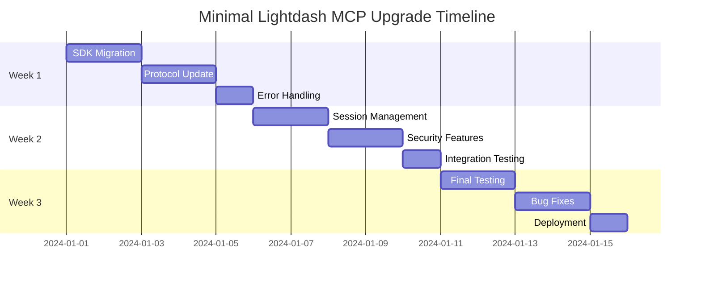

# Lightdash MCP Server Minimal Upgrade Plan

## Executive Summary

This document outlines a focused, minimal upgrade strategy for the Lightdash MCP server to modernize it to the latest MCP SDK standards (v1.20.2) with emphasis on essential improvements only. The upgrade is designed as a single-phase implementation to minimize risk and complexity while ensuring 100% backward compatibility.

### Current State Analysis
- **Current SDK Version**: v1.11.4
- **Target SDK Version**: v1.20.2
- **Current Architecture**: Basic Server class with dual transport support (Stdio/HTTP)
- **Authentication**: API key-based for Lightdash
- **Tools**: 13 comprehensive Lightdash API tools
- **Resources**: None implemented (will remain none)
- **Readiness Score**: 8/10

### Strategic Objectives
1. **SDK Modernization**: Upgrade to latest MCP SDK v1.20.2
2. **StreamableHTTP Enhancement**: Basic session management and connection stability
3. **Essential Security**: DNS protection, host header validation, basic CORS
4. **Error Handling**: Structured error responses and improved logging

### Expected Benefits
- **Compatibility**: 100% backward compatibility maintained
- **Stability**: Improved connection reliability and session management
- **Security**: Basic protection against common vulnerabilities
- **Maintainability**: Better error handling and logging for debugging
- **Future-Ready**: Foundation for potential future enhancements

---

## Implementation Plan

### Single Phase Implementation (2-3 Weeks)
*Focused, minimal upgrade with maximum backward compatibility*

#### Week 1: SDK Upgrade and Core Migration

**1.1 SDK Upgrade and Migration**
**Objective**: Update to MCP SDK v1.20.2 with minimal changes

**Technical Implementation**:
```typescript
// Current: Basic Server class
import { Server } from '@modelcontextprotocol/sdk/server/index.js';

// Target: McpServer high-level API (maintaining same functionality)
import { McpServer } from '@modelcontextprotocol/sdk/server/mcp.js';
```

**Key Changes**:
- Update package.json dependency: `"@modelcontextprotocol/sdk": "^1.20.2"`
- Migrate from `Server` to `McpServer` class
- Update import paths for new SDK structure
- Maintain existing tool functionality without changes

**Code Changes Required**:
- `src/mcp.ts`: Server class migration only
- `src/index.ts`: Update transport initialization
- `package.json`: Dependency updates
- Examples: Update client code for new SDK

**1.2 Protocol Version Update**
**Objective**: Implement protocol version 2025-06-18 with tools-only capability

**Implementation**:
```typescript
const server = new McpServer({
  name: serverName,
  version: serverVersion,
  protocolVersion: "2025-06-18",
  capabilities: {
    tools: {}, // Only tools capability - no resources or prompts
  }
});
```

#### Week 2: StreamableHTTP Improvements and Security

**2.1 Basic Session Management**
**Objective**: Improve connection stability without complex features

**Implementation**:
```typescript
const httpTransport = new StreamableHTTPServerTransport({
  sessionIdGenerator: () => crypto.randomUUID(),
  enableJsonResponse: true,
  // Basic session configuration only
  sessionTimeout: 30 * 60 * 1000, // 30 minutes
  maxSessions: 50, // Conservative limit
});
```

**2.2 DNS Rebinding Protection**
**Objective**: Essential security without complex authentication

**Implementation**:
```typescript
const httpTransport = new StreamableHTTPServerTransport({
  sessionIdGenerator: () => crypto.randomUUID(),
  enableJsonResponse: true,
  dnsRebindingProtection: {
    allowedHosts: process.env.ALLOWED_HOSTS?.split(',') || ['localhost'],
    requireHostHeader: true,
  }
});
```

**2.3 Basic CORS Configuration**
**Objective**: Proper CORS handling for web clients

**Implementation**:
```typescript
// Simple CORS configuration in server.ts
app.use(cors({
  origin: process.env.CORS_ORIGIN || '*',
  methods: ['GET', 'POST', 'OPTIONS'],
  allowedHeaders: ['Content-Type', 'Authorization'],
}));
```

#### Week 3: Enhanced Error Handling and Testing

**3.1 Structured Error Responses**
**Objective**: Better error handling and debugging without complex systems

**Implementation**:
- Implement proper MCP error codes
- Add structured error responses
- Improve error logging
- Maintain existing error behavior for compatibility

**3.2 Connection Stability**
**Objective**: Basic improvements to connection reliability

**Features**:
- Better error recovery
- Connection timeout handling
- Graceful shutdown
- Basic health checks

**3.3 Testing and Validation**
**Objective**: Ensure backward compatibility and stability

**Activities**:
- Comprehensive testing of all existing tools
- Validation of HTTP and Stdio transports
- Performance regression testing
- Security validation

---

## StreamableHTTP Improvements

### Basic Session Management
**Objective**: Improve connection stability with minimal complexity

#### Current Implementation
```typescript
// Current: Basic session ID generation
const httpTransport = new StreamableHTTPServerTransport({
  sessionIdGenerator: () => crypto.randomUUID(),
  enableJsonResponse: true,
});
```

#### Minimal Enhancement
```typescript
// Target: Basic session management
const httpTransport = new StreamableHTTPServerTransport({
  sessionIdGenerator: () => crypto.randomUUID(),
  enableJsonResponse: true,
  sessionTimeout: 30 * 60 * 1000, // 30 minutes
  maxSessions: 50, // Conservative limit
});
```

### Basic Security Implementation

#### DNS Rebinding Protection
```typescript
const httpTransport = new StreamableHTTPServerTransport({
  sessionIdGenerator: () => crypto.randomUUID(),
  enableJsonResponse: true,
  dnsRebindingProtection: {
    allowedHosts: process.env.ALLOWED_HOSTS?.split(',') || ['localhost'],
    requireHostHeader: true,
  }
});
```

#### Basic CORS Configuration
```typescript
// Simple CORS setup in server.ts
app.use(cors({
  origin: process.env.CORS_ORIGIN || '*',
  methods: ['GET', 'POST', 'OPTIONS'],
  allowedHeaders: ['Content-Type', 'Authorization'],
}));
```

### Connection Stability

#### Basic Error Recovery
- Connection timeout handling
- Graceful shutdown procedures
- Simple retry logic for network errors
- Basic health check endpoint

#### Host Header Validation
```typescript
// Basic host validation middleware
app.use((req, res, next) => {
  const allowedHosts = ['localhost', '127.0.0.1'];
  const host = req.get('host');
  if (host && !allowedHosts.includes(host.split(':')[0])) {
    return res.status(403).json({ error: 'Host not allowed' });
  }
  next();
});
```

---

## Technical Implementation Details

### Minimal Dependencies Update
```json
{
  "dependencies": {
    "@modelcontextprotocol/sdk": "^1.20.2",
    "express": "^4.21.2",
    "lightdash-client-typescript-fetch": "^0.0.4-202503270130",
    "typescript": "^5.7.2",
    "zod": "^3.24.1",
    "cors": "^2.8.5"
  }
}
```

### Server Migration Pattern
```typescript
// Before: src/mcp.ts
import { Server } from '@modelcontextprotocol/sdk/server/index.js';

export const server = new Server({
  name: serverName,
  version: serverVersion,
}, {
  capabilities: { tools: {} }
});

// After: src/mcp.ts (minimal change)
import { McpServer } from '@modelcontextprotocol/sdk/server/mcp.js';

export const server = new McpServer({
  name: serverName,
  version: serverVersion,
  protocolVersion: "2025-06-18",
}, {
  capabilities: {
    tools: {}, // Only tools capability
  }
});
```

### Basic Transport Enhancement
```typescript
// Minimal HTTP transport configuration
const httpTransport = new StreamableHTTPServerTransport({
  sessionIdGenerator: () => crypto.randomUUID(),
  enableJsonResponse: true,
  sessionTimeout: 30 * 60 * 1000, // 30 minutes
  maxSessions: 50, // Conservative limit
  dnsRebindingProtection: {
    allowedHosts: process.env.ALLOWED_HOSTS?.split(',') || ['localhost'],
    requireHostHeader: true,
  }
});
```

### Enhanced Error Handling
```typescript
// Basic structured error responses
export class ErrorHandler {
  static handleMcpError(error: any): McpError {
    if (error.code === 'LIGHTDASH_API_ERROR') {
      return new McpError(
        ErrorCode.InvalidRequest,
        `Lightdash API error: ${error.message}`,
        { originalError: error }
      );
    }
    
    return new McpError(
      ErrorCode.InternalError,
      error.message || 'Internal server error',
      { originalError: error.name }
    );
  }
}
```

---

## Migration Strategy

### Backward Compatibility Approach

#### Version Support Matrix
| Feature | v1.11.4 | v1.20.2 | Migration Path |
|---------|---------|---------|----------------|
| Basic Tools | ✅ | ✅ | Direct compatibility |
| HTTP Transport | ✅ | ✅ Enhanced | Basic enhancement only |
| Resources | ❌ | ❌ | Not implemented |
| Prompts | ❌ | ❌ | Not implemented |
| OAuth 2.0 | ❌ | ❌ | Not implemented |

#### Migration Steps
1. **Preparation Phase**: Backup current configuration
2. **SDK Update**: Update dependencies maintaining compatibility
3. **Basic Enhancement**: Apply minimal improvements only
4. **Validation Phase**: Comprehensive testing with existing clients
5. **Single Deployment**: Direct deployment with rollback capability

### Simple Deployment Strategy

#### Direct Deployment Approach
1. **Current Environment**: v1.11.4 implementation
2. **Updated Environment**: v1.20.2 with minimal changes
3. **Immediate Switch**: Single deployment with rollback capability
4. **Monitoring**: Basic health checks and error monitoring

#### Basic Health Check Implementation
```typescript
// Basic health check endpoint
app.get('/health', async (req, res) => {
  try {
    // Simple Lightdash API connectivity check
    const { data, error } = await lightdashClient.GET('/api/v1/org/projects', {});
    
    if (error) {
      return res.status(503).json({
        status: 'unhealthy',
        error: 'Lightdash API connection failed'
      });
    }
    
    res.json({
      status: 'healthy',
      timestamp: new Date().toISOString(),
      version: packageVersion
    });
  } catch (error) {
    res.status(503).json({
      status: 'unhealthy',
      error: 'Health check failed'
    });
  }
});
```

---

## Risk Assessment

### Low-Risk Minimal Upgrade

#### 1. SDK Migration
**Risk Level**: Low
**Impact**: Minimal - maintaining same functionality
**Mitigation**:
- Direct API compatibility maintained
- Comprehensive testing of existing tools
- Simple rollback to v1.11.4 if needed
- No new features to break

#### 2. Basic Session Management
**Risk Level**: Low
**Impact**: Improved connection stability
**Mitigation**:
- Conservative session limits
- Backward compatible configuration
- Simple timeout handling
- No complex state management

#### 3. Basic Security Enhancements
**Risk Level**: Low
**Impact**: Improved security without breaking changes
**Mitigation**:
- DNS protection with safe defaults
- Host header validation with fallbacks
- Basic CORS without restrictions
- No authentication changes

### Risk Mitigation Strategies

#### Simple Testing Strategy
```typescript
// tests/integration/minimal-upgrade.test.ts
describe('Minimal SDK Upgrade', () => {
  test('All existing tools work with new SDK', async () => {
    // Test all 13 existing tools
    const tools = await server.listTools();
    expect(tools).toHaveLength(13);
    
    // Test each tool still works
    for (const tool of tools) {
      const result = await server.callTool(tool.name, {});
      expect(result).toBeDefined();
    }
  });

  test('HTTP transport maintains compatibility', async () => {
    // Test HTTP transport still works
    const response = await fetch('/mcp', {
      method: 'POST',
      body: JSON.stringify({ method: 'tools/list' })
    });
    expect(response.ok).toBe(true);
  });
});
```

#### Basic Monitoring
```typescript
// Simple error tracking
let errorCount = 0;
let requestCount = 0;

app.use((req, res, next) => {
  requestCount++;
  res.on('finish', () => {
    if (res.statusCode >= 400) {
      errorCount++;
    }
  });
  next();
});

// Basic health endpoint with error rate
app.get('/health', (req, res) => {
  const errorRate = requestCount > 0 ? (errorCount / requestCount) : 0;
  res.json({
    status: errorRate < 0.05 ? 'healthy' : 'degraded',
    errorRate,
    requestCount
  });
});
```

---

## Success Metrics

### Minimal Upgrade Success Criteria
- [ ] SDK upgrade completed without breaking existing functionality
- [ ] All 13 existing tools work with new SDK
- [ ] HTTP transport maintains backward compatibility
- [ ] Basic DNS rebinding protection active and tested
- [ ] Enhanced error handling provides clearer error messages
- [ ] Basic session management improves connection stability
- [ ] Simple health check endpoint functional

### Key Performance Indicators (KPIs)

#### Performance Metrics
- **Response Time**: Maintain current performance levels
- **Throughput**: Support existing concurrent sessions
- **Memory Usage**: No significant increase from current usage
- **CPU Usage**: No significant increase from current usage

#### Reliability Metrics
- **Uptime**: Maintain current availability levels
- **Error Rate**: No increase in error rates
- **Session Stability**: Improved connection stability
- **Recovery Time**: Maintain or improve current recovery times

#### Security Metrics
- **DNS Protection**: Basic rebinding attack protection
- **Host Validation**: Proper host header validation
- **CORS Configuration**: Basic CORS protection
- **Error Information**: No sensitive data in error responses

---

## Timeline Estimates

### Minimal Upgrade Timeline (2-3 Weeks)

#### Week 1: SDK Upgrade and Core Migration
- **Days 1-2**: Dependency updates and SDK migration
  - Update package.json to MCP SDK v1.20.2
  - Migrate from Server to McpServer class
  - Update import paths and basic initialization
- **Days 3-4**: Protocol version update and testing
  - Implement protocol version 2025-06-18
  - Test all existing tools with new SDK
  - Verify backward compatibility
- **Day 5**: Basic error handling improvements
  - Implement structured error responses
  - Add basic error logging
  - Test error scenarios

#### Week 2: StreamableHTTP and Security Enhancements
- **Days 1-2**: Basic session management
  - Add session timeout configuration
  - Implement conservative session limits
  - Test connection stability
- **Days 3-4**: Security enhancements
  - Implement DNS rebinding protection
  - Add host header validation
  - Configure basic CORS
- **Day 5**: Integration testing
  - Test HTTP and Stdio transports
  - Validate security features
  - Performance regression testing

#### Week 3: Final Testing and Deployment (Optional)
- **Days 1-2**: Comprehensive testing
  - End-to-end testing of all tools
  - Load testing with existing clients
  - Security validation
- **Days 3-4**: Bug fixes and optimization
  - Address any issues found in testing
  - Performance tuning if needed
  - Documentation updates
- **Day 5**: Deployment preparation
  - Final validation
  - Rollback plan preparation
  - Go-live preparation

### Critical Path


---

## Resource Requirements

### Minimal Team Structure

#### Core Team (Required)
- **Senior Backend Developer** (0.5-1.0 FTE): SDK migration and basic enhancements
- **QA Engineer** (0.25 FTE): Testing existing functionality and compatibility

#### Optional Support
- **DevOps Engineer** (0.1 FTE): Deployment assistance if needed
- **Technical Writer** (0.1 FTE): Documentation updates

### Technical Infrastructure

#### Development Environment
- **Existing CI/CD Pipeline**: Use current setup
- **Testing Infrastructure**: Basic automated testing
- **Version Control**: Standard Git workflow
- **Documentation**: Update existing documentation

#### Production Environment
- **Current Infrastructure**: No additional infrastructure needed
- **Basic Monitoring**: Simple health checks and error logging
- **Deployment**: Standard deployment process
- **Rollback Capability**: Git-based rollback to v1.11.4

### Budget Estimates

#### Development Costs (2-3 weeks)
- **Core Team**: $8,000 - $15,000
- **Optional Support**: $1,000 - $2,000
- **Infrastructure**: $0 (using existing)
- **Tools & Licenses**: $0 (using existing)
- **Total**: $9,000 - $17,000

#### Ongoing Costs
- **No additional ongoing costs**: Uses existing infrastructure
- **Maintenance**: Standard maintenance procedures

---

## Rollback Plan

### Simple Rollback Strategy

#### Rollback Triggers
- Any breaking changes to existing functionality
- Significant performance degradation
- Client compatibility issues
- Critical errors in production

### Rollback Procedures

#### Immediate Rollback to v1.11.4
```bash
# Simple Git-based rollback
git checkout v1.11.4-stable
npm ci  # Install exact previous dependencies
npm run build
npm start

# Verify rollback
curl http://localhost:8088/health
```

#### Configuration Backup and Restore
```bash
# Backup before upgrade
cp package.json package.json.backup
cp package-lock.json package-lock.json.backup
cp .env .env.backup

# Restore if needed
cp package.json.backup package.json
cp package-lock.json.backup package-lock.json
cp .env.backup .env
npm ci
```

### Rollback Testing
- Test rollback procedure in development environment
- Verify all existing functionality works after rollback
- Ensure no data loss during rollback process

---

## Conclusion

This minimal upgrade plan provides a focused, low-risk approach to modernizing the Lightdash MCP server to SDK v1.20.2. The plan prioritizes backward compatibility and stability over advanced features.

### Key Success Factors
1. **Minimal Changes**: Only essential updates to reduce risk
2. **Backward Compatibility**: 100% compatibility with existing clients
3. **Simple Testing**: Focus on existing functionality validation
4. **Quick Rollback**: Simple Git-based rollback strategy
5. **Conservative Timeline**: 2-3 weeks for thorough testing

### Expected Outcomes
- **Modernized SDK**: Updated to latest MCP SDK v1.20.2
- **Improved Stability**: Better connection management and error handling
- **Enhanced Security**: Basic protection against common vulnerabilities
- **Future Ready**: Foundation for potential future enhancements
- **Zero Disruption**: No impact on existing users or workflows

### Next Steps
1. **Stakeholder Approval**: Review and approve this minimal plan
2. **Development Start**: Begin SDK migration and basic enhancements
3. **Testing Phase**: Comprehensive testing of existing functionality
4. **Deployment**: Single deployment with rollback capability

This plan ensures the Lightdash MCP server stays current with modern standards while maintaining the stability and reliability that users depend on.