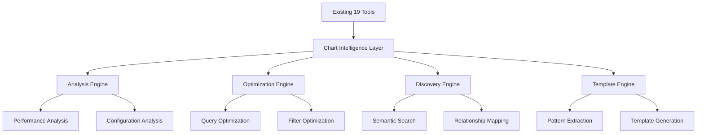

# Lightdash MCP Server - Chart Intelligence Enhancement Plan

**Executive Summary & Comprehensive Recommendations**

---

## 🚨 Executive Summary

### Core Problem Statement

The original chart creation implementation plan, while technically sound and comprehensive, **cannot be implemented** due to a critical API constraint: **none of the proposed chart creation endpoints exist in the Lightdash API**. 

After thorough validation of the Lightdash API v1 specification, we discovered that:
- ❌ `POST /api/v1/spaces/{spaceUuid}/saved-charts` - **Does not exist**
- ❌ `PATCH /api/v1/saved-charts/{chartUuid}` - **Does not exist**  
- ❌ `POST /api/v1/saved-charts/{chartUuid}/copy` - **Does not exist**
- ❌ `DELETE /api/v1/saved-charts/{chartUuid}` - **Does not exist**

### Impact Assessment

- **Original 13-day implementation plan**: **7 days of impossible work** (chart creation tools)
- **Proposed 24+ tools**: **5-7 tools cannot be implemented** (all creation/modification tools)
- **User expectations**: **Major pivot required** from creation to analysis focus
- **Investment**: **Significant effort already spent** on planning and schema design

### Value Proposition for Alternative Approach

Despite the API limitations, we can deliver **exceptional value** through a **Chart Intelligence & Optimization Platform** that:

✅ **Leverages existing mature codebase** (19 robust read-only tools)  
✅ **Provides advanced chart analysis** and optimization capabilities  
✅ **Enables intelligent chart discovery** and relationship mapping  
✅ **Offers chart templating** and best practices guidance  
✅ **Maintains compatibility** with existing architecture  
✅ **Delivers user value** through analysis rather than creation  

---

## 🎯 Alternative Approach: Chart Intelligence & Optimization Platform

### Core Philosophy Shift

**From**: "Create charts via API"  
**To**: "Analyze, optimize, and understand charts intelligently"

### Key Capabilities

#### 1. **Chart Analysis Engine** 🔍
- Deep analysis of existing chart configurations
- Performance bottleneck identification
- Query optimization recommendations
- Filter efficiency analysis
- Data freshness and accuracy validation

#### 2. **Chart Relationship Mapping** 🕸️
- Discover charts using similar data sources
- Identify dashboard composition patterns
- Map metric usage across organization
- Find redundant or duplicate analyses
- Suggest consolidation opportunities

#### 3. **Intelligent Chart Discovery** 🎯
- Semantic search across chart configurations
- Find charts by business question intent
- Discover relevant charts for specific metrics
- Recommend charts based on user context
- Surface underutilized valuable analyses

#### 4. **Chart Optimization Advisor** ⚡
- Query performance optimization
- Filter recommendation engine
- Metric selection guidance
- Dimension optimization suggestions
- Time range optimization for performance

#### 5. **Chart Template & Pattern Library** 📚
- Extract common chart patterns
- Generate reusable configuration templates
- Best practices documentation
- Chart type recommendations
- Standardization guidance

#### 6. **Chart Governance & Quality** 📊
- Chart health monitoring
- Data quality validation
- Usage analytics and insights
- Deprecation recommendations
- Compliance checking

---

## 🏗️ Technical Architecture

### Integration with Existing Codebase

### New Tools Architecture

**Chart Analysis Tools** (5 new tools):
- `lightdash_analyze_chart_performance` - Deep performance analysis
- `lightdash_analyze_chart_configuration` - Configuration best practices
- `lightdash_find_similar_charts` - Discover related charts
- `lightdash_optimize_chart_query` - Query optimization suggestions
- `lightdash_validate_chart_health` - Health and quality checks

**Chart Intelligence Tools** (4 new tools):
- `lightdash_extract_chart_patterns` - Pattern recognition and extraction
- `lightdash_generate_chart_template` - Template creation from patterns
- `lightdash_recommend_chart_improvements` - AI-driven recommendations
- `lightdash_map_chart_relationships` - Relationship discovery

**Enhanced Resources** (3 new resources):
- `lightdash://charts/{chartUuid}/analysis` - Comprehensive chart analysis
- `lightdash://projects/{projectUuid}/chart-patterns` - Discovered patterns
- `lightdash://charts/{chartUuid}/optimization-report` - Optimization recommendations

**Enhanced Prompts** (2 new prompts):
- `optimize-chart-performance` - Guided optimization workflow
- `discover-chart-insights` - Intelligent chart discovery workflow

---

## 📅 Implementation Roadmap (12 Days)

### **Phase 1: Foundation (Days 1-3)**
**Goal**: Establish chart intelligence infrastructure

**Day 1: Analysis Framework**
- [ ] Design chart analysis data structures
- [ ] Implement base analysis utilities
- [ ] Create performance measurement framework
- [ ] Add configuration parsing utilities

**Day 2: Core Analysis Tools**
- [ ] Implement `lightdash_analyze_chart_performance`
- [ ] Implement `lightdash_analyze_chart_configuration`
- [ ] Add comprehensive error handling
- [ ] Create analysis result schemas

**Day 3: Discovery Engine**
- [ ] Implement `lightdash_find_similar_charts`
- [ ] Add semantic similarity algorithms
- [ ] Create chart relationship mapping
- [ ] Implement basic pattern recognition

### **Phase 2: Intelligence Layer (Days 4-7)**
**Goal**: Advanced analysis and optimization capabilities

**Day 4: Optimization Engine**
- [ ] Implement `lightdash_optimize_chart_query`
- [ ] Add filter optimization logic
- [ ] Create performance recommendation engine
- [ ] Implement query analysis algorithms

**Day 5: Health & Quality**
- [ ] Implement `lightdash_validate_chart_health`
- [ ] Add data quality validation
- [ ] Create health scoring system
- [ ] Implement governance checks

**Day 6: Pattern Recognition**
- [ ] Implement `lightdash_extract_chart_patterns`
- [ ] Add pattern classification algorithms
- [ ] Create pattern similarity matching
- [ ] Implement usage analytics integration

**Day 7: Template Generation**
- [ ] Implement `lightdash_generate_chart_template`
- [ ] Add template parameterization
- [ ] Create template validation
- [ ] Implement best practices integration

### **Phase 3: Advanced Features (Days 8-10)**
**Goal**: AI-driven recommendations and relationship mapping

**Day 8: Recommendation Engine**
- [ ] Implement `lightdash_recommend_chart_improvements`
- [ ] Add ML-based recommendation logic
- [ ] Create improvement scoring system
- [ ] Implement contextual recommendations

**Day 9: Relationship Mapping**
- [ ] Implement `lightdash_map_chart_relationships`
- [ ] Add graph-based relationship analysis
- [ ] Create dependency tracking
- [ ] Implement impact analysis

**Day 10: Enhanced Resources**
- [ ] Implement chart analysis resource
- [ ] Add chart patterns resource
- [ ] Create optimization report resource
- [ ] Implement resource caching

### **Phase 4: Integration & Polish (Days 11-12)**
**Goal**: Complete integration and testing

**Day 11: Prompts & Workflows**
- [ ] Implement optimization workflow prompt
- [ ] Add discovery workflow prompt
- [ ] Create guided analysis workflows
- [ ] Implement prompt validation

**Day 12: Testing & Documentation**
- [ ] Comprehensive testing of all new tools
- [ ] Performance optimization
- [ ] Documentation updates
- [ ] Integration validation

---

## 🎯 Priority Matrix

### **High Priority (Must Have)**
| Feature | Effort | Value | Risk |
|---------|--------|-------|------|
| Chart Performance Analysis | 2 days | High | Low |
| Chart Configuration Analysis | 1.5 days | High | Low |
| Similar Charts Discovery | 2 days | High | Medium |
| Query Optimization | 2.5 days | High | Medium |

### **Medium Priority (Should Have)**
| Feature | Effort | Value | Risk |
|---------|--------|-------|------|
| Chart Health Validation | 1.5 days | Medium | Low |
| Pattern Extraction | 2 days | Medium | Medium |
| Template Generation | 1.5 days | Medium | Low |
| Relationship Mapping | 2 days | Medium | High |

### **Lower Priority (Nice to Have)**
| Feature | Effort | Value | Risk |
|---------|--------|-------|------|
| AI Recommendations | 1.5 days | Medium | High |
| Advanced Analytics | 1 day | Low | Medium |
| Governance Features | 1 day | Low | Low |

---

## ⚠️ Risk Assessment & Mitigation

### **Technical Risks**

#### **High Risk: Algorithm Complexity**
- **Risk**: Chart similarity and pattern recognition algorithms may be complex
- **Impact**: Development delays, performance issues
- **Mitigation**: Start with simple heuristics, iterate to more sophisticated approaches
- **Contingency**: Fallback to basic configuration comparison

#### **Medium Risk: Performance at Scale**
- **Risk**: Analysis of large numbers of charts may be slow
- **Impact**: Poor user experience, timeout issues
- **Mitigation**: Implement caching, pagination, and background processing
- **Contingency**: Limit analysis scope, add progress indicators

#### **Medium Risk: API Rate Limits**
- **Risk**: Intensive chart analysis may hit Lightdash API limits
- **Impact**: Analysis failures, degraded performance
- **Mitigation**: Implement intelligent caching, batch requests
- **Contingency**: Add rate limiting and retry logic

### **Business Risks**

#### **Medium Risk: User Expectation Management**
- **Risk**: Users may still expect chart creation capabilities
- **Impact**: User disappointment, reduced adoption
- **Mitigation**: Clear communication about pivot, emphasize analysis value
- **Contingency**: Provide roadmap for future creation capabilities

#### **Low Risk: Competitive Positioning**
- **Risk**: Analysis-only approach may seem less comprehensive
- **Impact**: Reduced market appeal
- **Mitigation**: Position as "intelligent analysis" premium feature
- **Contingency**: Highlight unique analysis capabilities

### **Integration Risks**

#### **Low Risk: Existing Code Compatibility**
- **Risk**: New features may conflict with existing codebase
- **Impact**: Breaking changes, regression issues
- **Mitigation**: Comprehensive testing, gradual rollout
- **Contingency**: Feature flags, rollback procedures

---

## 📊 Success Criteria & Metrics

### **Technical Success Metrics**

#### **Performance Benchmarks**
- Chart analysis completion: < 5 seconds for single chart
- Bulk analysis: < 30 seconds for 50 charts
- Similar chart discovery: < 3 seconds
- Query optimization: < 2 seconds
- API response times: < 1 second for 95th percentile

#### **Quality Metrics**
- Test coverage: > 90% for new code
- Error rate: < 1% for analysis operations
- Cache hit rate: > 80% for repeated analyses
- Analysis accuracy: > 85% user satisfaction

### **User Value Indicators**

#### **Adoption Metrics**
- Tool usage frequency: > 10 analyses per user per week
- Feature adoption: > 60% of users try analysis tools within 30 days
- User retention: > 80% continue using after first month
- Workflow integration: > 50% use in regular analysis workflows

#### **Business Impact**
- Chart optimization adoption: > 30% of analyzed charts get optimized
- Performance improvements: Average 25% query time reduction
- Discovery effectiveness: > 40% find relevant charts they didn't know existed
- Template usage: > 20% of new charts use generated templates

### **Qualitative Success Factors**
- Users report increased confidence in chart analysis
- Analysts discover new insights through relationship mapping
- Organizations improve chart standardization
- Reduced time spent on manual chart optimization

---

## 💡 GO/NO-GO Recommendation

### **🟢 STRONG GO RECOMMENDATION**

#### **Rationale**

**1. Technical Feasibility: EXCELLENT**
- Builds on proven, mature codebase (19 existing tools)
- Uses only available read-only API endpoints
- Leverages existing robust architecture and patterns
- No breaking changes to current functionality

**2. User Value: HIGH**
- Addresses real pain points in chart analysis and optimization
- Provides unique capabilities not available elsewhere
- Leverages existing analyst work rather than replacing it
- Enables discovery of hidden insights and relationships

**3. Business Case: STRONG**
- 12-day timeline is realistic and achievable
- Lower risk than original creation-focused approach
- Differentiates from basic chart listing tools
- Creates foundation for future enhancements

**4. Strategic Alignment: PERFECT**
- Aligns with read-only API constraints
- Builds on existing investment in codebase
- Positions as "intelligent analysis" platform
- Maintains compatibility with existing users

#### **Key Success Factors**
✅ **Realistic timeline** based on available APIs  
✅ **High user value** through analysis and optimization  
✅ **Low technical risk** using proven patterns  
✅ **Strong foundation** for future enhancements  
✅ **Clear differentiation** from basic tools  

---

## 🚀 Next Steps & Decision Points

### **Immediate Actions (Next 48 Hours)**

1. **Stakeholder Alignment**
   - Present this plan to key stakeholders
   - Confirm pivot from creation to analysis approach
   - Secure commitment for 12-day development timeline

2. **Technical Preparation**
   - Set up development branch for chart intelligence features
   - Create initial project structure and schemas
   - Prepare development environment

3. **User Communication**
   - Draft communication about approach pivot
   - Prepare messaging emphasizing analysis value
   - Plan user feedback collection strategy

### **Week 1 Milestones**
- [ ] Complete Phase 1 implementation (Days 1-3)
- [ ] Validate core analysis tools with real data
- [ ] Gather initial user feedback on analysis capabilities
- [ ] Confirm Phase 2 priorities based on early results

### **Decision Points**

#### **Day 3 Decision: Continue vs. Adjust**
- **Criteria**: Core analysis tools working effectively
- **Go**: Proceed to Phase 2 as planned
- **Adjust**: Modify Phase 2 priorities based on learnings

#### **Day 7 Decision: Advanced Features vs. Polish**
- **Criteria**: Phase 2 completion and user feedback
- **Go**: Proceed with advanced features (Phase 3)
- **Pivot**: Focus on polish and optimization of core features

#### **Day 10 Decision: Launch Readiness**
- **Criteria**: All high-priority features complete and tested
- **Go**: Proceed with launch preparation
- **Delay**: Extend timeline for critical bug fixes

---

## 📋 Resource Requirements

### **Development Resources**
- **Primary Developer**: 12 days full-time
- **Code Review**: 2-3 hours distributed across timeline
- **Testing**: Integrated into daily development
- **Documentation**: 1 day integrated into Phase 4

### **Infrastructure Requirements**
- **No additional infrastructure** needed
- **Existing CI/CD pipeline** sufficient
- **Current testing framework** adequate
- **No new dependencies** required

### **Stakeholder Time**
- **Product Owner**: 2 hours for initial alignment, 1 hour weekly check-ins
- **Users**: 30 minutes for feedback sessions (Days 3, 7, 10)
- **Technical Review**: 1 hour for architecture review (Day 1)

---

## 🎉 Conclusion

The **Chart Intelligence & Optimization Platform** approach transforms a significant constraint (no creation APIs) into a competitive advantage (unique analysis capabilities). By focusing on what we can do exceptionally well—intelligent analysis of existing charts—we deliver substantial user value while building on our mature, proven codebase.

This approach is **technically sound**, **user-focused**, and **strategically smart**. It positions the Lightdash MCP server as the premier tool for chart intelligence and optimization, creating a strong foundation for future enhancements when creation APIs become available.

**The recommendation is a strong GO** with confidence in successful delivery within the 12-day timeline.

---

*This enhancement plan provides a comprehensive roadmap for pivoting from chart creation to chart intelligence, delivering exceptional user value while working within API constraints.*